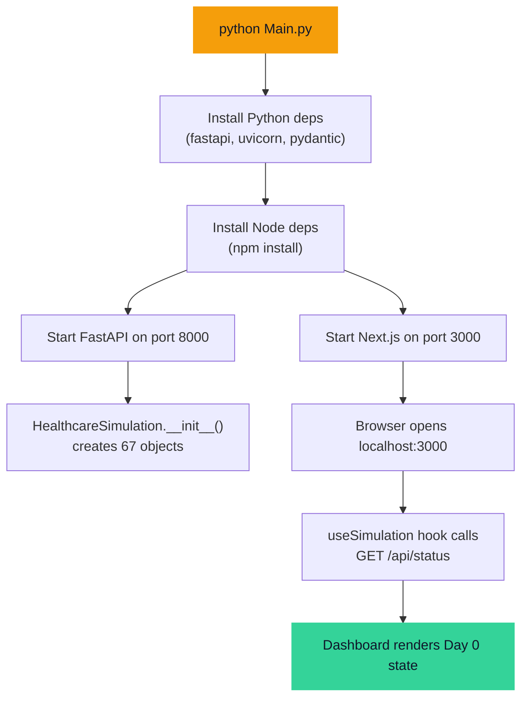
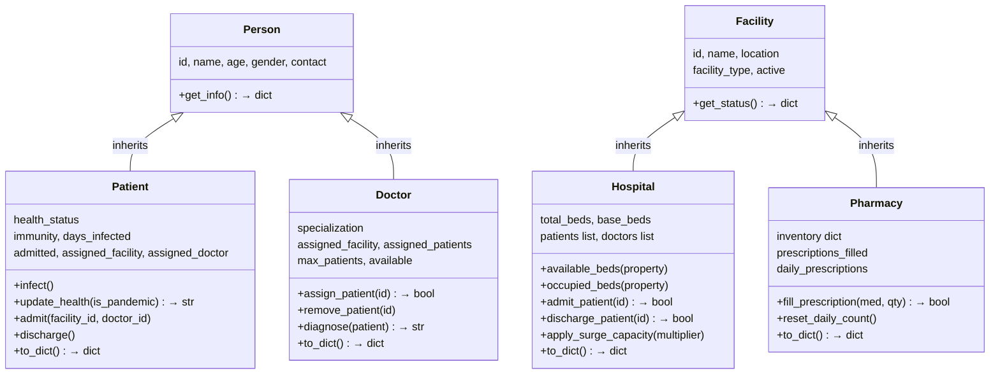
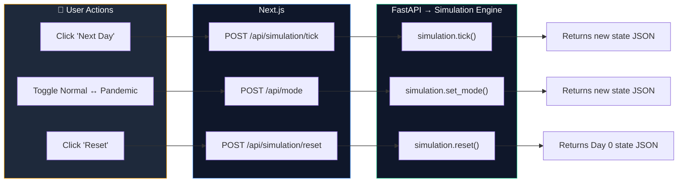
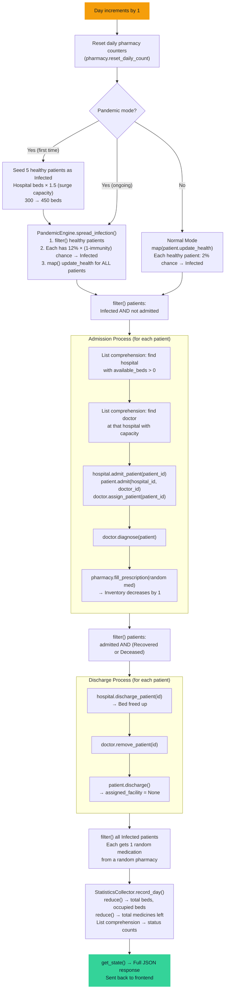
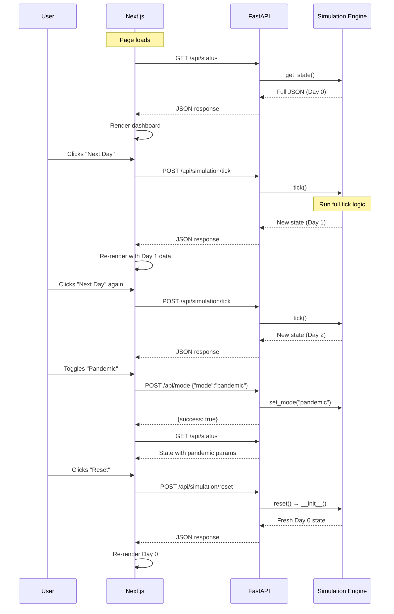

# Healthcare Simulation System — Project Workflow

## 1. What This Project Is

A **simulated healthcare network** with hospitals, pharmacies, patients, and doctors. The user advances the simulation **one day at a time** by clicking "Next Day". Each day, patients get sick, get admitted, recover, or die. Medications are dispensed and inventory depletes. The user can switch between **Normal** and **Pandemic** mode, and **Reset** everything back to Day 0.

---

## 2. How It Starts



[Main.py](file:///Users/akshitbahl/Documents/Projects/PythonHealthcareSystem/Main.py) runs **one command** that boots both servers. The backend creates the simulation world immediately, and the frontend fetches the initial state once on page load.

---

## 3. The OOP Class Hierarchy (9 Classes)



Plus 4 non-inherited classes:

| Class | Purpose |
|-------|---------|
| `SimulationMode` | Holds Normal/Pandemic parameters (infection_rate, recovery_rate, etc.) |
| `PandemicEngine` | SIR infection model — seeds infections, spreads disease |
| `StatisticsCollector` | Records day-by-day snapshots for time-series charts |
| `HealthcareSimulation` | **Orchestrator** — owns everything, runs the tick loop |

### Why Inheritance?

**Person → Patient, Doctor**: Both share `id`, `name`, `age`, `gender`, `contact` via `Person.__init__()`. Patient adds health/infection logic. Doctor adds specialization and patient management.

**Facility → Hospital, Pharmacy**: Both share `id`, `name`, `location`, `facility_type`, `active` via `Facility.__init__()`. Hospital adds bed management. Pharmacy adds medication inventory.

Without inheritance, we'd duplicate 5+ attributes and `get_info()`/`get_status()` methods across each subclass.

---

## 4. What Gets Created at Startup

When [HealthcareSimulation.__init__()](file:///Users/akshitbahl/Documents/Projects/PythonHealthcareSystem/backend/engine/simulation.py#L69-L96) runs:

| What | How Many | Details |
|------|----------|---------|
| **Patients** | 50 | Random names, ages (5–85), genders, immunity (0.3–0.9) |
| **Doctors** | 12 | Random names, rotating specializations, assigned 4 per hospital |
| **Hospitals** | 3 | City General (120 beds), St. Mary's (80), University (100) = **300 total beds** |
| **Pharmacies** | 2 | Each with 8 medications (Paracetamol: 500, Amoxicillin: 200, etc.) = **~3960 total medicines** |

Doctors are assigned to hospitals round-robin (4 per hospital). All 50 patients start as **Healthy**. Day 0 stats are recorded.

---

## 5. The User Interaction Flow

There are only **3 user actions**:



> [!NOTE]
> There is **no automatic ticking**, **no polling**, **no WebSocket**. The frontend only talks to the backend when the user clicks a button. The response JSON is used to immediately re-render the UI.

---

## 6. What Happens When You Click "Next Day"

This is the core of the project — the [tick()](file:///Users/akshitbahl/Documents/Projects/PythonHealthcareSystem/backend/engine/simulation.py#L166-L215) method:



### Step-by-Step Detail

#### Step 1 — Health Updates

Every patient's [update_health()](file:///Users/akshitbahl/Documents/Projects/PythonHealthcareSystem/backend/models/person.py#L97-L122) runs:

```
If patient is Deceased → skip (no change)

If patient is Infected:
  - days_infected += 1
  - Recovery chance = immunity × 0.2  (e.g. immunity=0.6 → 12% chance)
  - Mortality rate = 3% if admitted, 8% if NOT admitted
  - If age > 60: mortality × 1.5
  - Roll dice → Recover OR Die OR stay Infected

If patient is Healthy:
  - Normal mode: 2% chance → Infected
  - Pandemic mode: 8% chance → Infected
```

**Key insight**: Admitted patients have **lower mortality** (3% vs 8%) — hospitals save lives. Older patients are more vulnerable (1.5× death rate).

#### Step 2 — Admissions

```python
# filter() finds patients who need a hospital bed
needs_admission = list(filter(
    lambda p: p.health_status == "Infected" and not p.admitted,
    self.patients
))
```

For each patient:
1. **List comprehension** finds a hospital with `available_beds > 0`
2. **List comprehension** finds a doctor at that hospital with fewer than 8 patients
3. If both found → patient is admitted, bed is occupied, medication dispensed

#### Step 3 — Discharges

```python
# filter() finds patients who can leave
can_discharge = list(filter(
    lambda p: p.admitted and p.health_status in ("Recovered", "Deceased"),
    self.patients
))
```

Each discharged patient frees a hospital bed and removes them from their doctor's list.

#### Step 4 — Daily Medications

Every currently Infected patient gets 1 random medication dispensed from a random pharmacy. This depletes pharmacy inventory each day.

#### Step 5 — Statistics

```python
# reduce() aggregates across all 3 hospitals
total_occupied = reduce(lambda acc, h: acc + h.occupied_beds, self.hospitals, 0)
total_capacity = reduce(lambda acc, h: acc + h.total_beds, self.hospitals, 0)

# reduce() aggregates across all 2 pharmacies
total_medicines = reduce(lambda acc, ph: acc + sum(ph.inventory.values()), self.pharmacies, 0)
```

A full snapshot is saved into `StatisticsCollector` for charts.

---

## 7. Normal Mode vs Pandemic Mode

| Parameter | Normal | Pandemic |
|-----------|--------|----------|
| **Infection rate** | 2% | 12% |
| **Recovery rate** | 15% | 8% |
| **Mortality rate** | 2% | 5% |
| **Hospital beds** | 300 (base) | 450 (1.5× surge) |

### What Happens on Mode Switch

**Normal → Pandemic** ([set_mode("pandemic")](file:///Users/akshitbahl/Documents/Projects/PythonHealthcareSystem/backend/engine/simulation.py#L291-L311)):
1. All SimulationMode parameters update to pandemic values
2. On next tick: 5 random healthy patients are seeded as Infected
3. Hospital beds scale from 300 → 450

**Pandemic → Normal**:
1. Parameters reset to normal values
2. `PandemicEngine` counters reset
3. Hospital beds reset to 300

---

## 8. What Happens on Reset

[simulation.reset()](file:///Users/akshitbahl/Documents/Projects/PythonHealthcareSystem/backend/engine/simulation.py#L368-L374) calls `self.__init__()` which:
- Generates **50 new patients** (all Healthy, new random names/ages)
- Generates **12 new doctors** (new random names)
- Creates **3 fresh hospitals** (300 beds, all empty)
- Creates **2 fresh pharmacies** (full inventory: ~3960 medicines)
- Resets day to 0, mode to Normal
- Records Day 0 stats

Everything starts from scratch.

---

## 9. Frontend ↔ Backend Communication



### API Endpoints

| Endpoint | Method | When Called | What It Does |
|---|---|---|---|
| `/api/status` | GET | Page load (once) | Returns full simulation snapshot |
| `/api/simulation/tick` | POST | User clicks "Next Day" | Runs tick(), returns new state |
| `/api/simulation/reset` | POST | User clicks "Reset" | Calls reset(), returns Day 0 state |
| `/api/mode` | POST | User toggles mode | Switches Normal ↔ Pandemic |
| `/api/hospitals` | GET | Hospital page | Hospital details with occupancy |
| `/api/patients` | GET | Patient page | All 50 patients with statuses |
| `/api/pharmacy` | GET | Pharmacy page | Inventory for both pharmacies |
| `/api/statistics` | GET | Statistics page | Day-by-day time-series records |

---

## 10. The JSON Response Structure

Every tick returns this from [get_state()](file:///Users/akshitbahl/Documents/Projects/PythonHealthcareSystem/backend/engine/simulation.py#L313-L369):

```json
{
  "day": 5,
  "mode": {
    "mode": "pandemic",
    "is_pandemic": true,
    "infection_rate": 0.12,
    "recovery_rate": 0.08,
    "mortality_rate": 0.05,
    "surge_capacity_multiplier": 1.5
  },
  "overview": {
    "total_patients": 50,
    "total_doctors": 12,
    "total_hospitals": 3,
    "total_pharmacies": 2,
    "total_beds": 450,
    "total_occupied_beds": 14,
    "total_available_beds": 436,
    "overall_occupancy": 3.1,
    "total_medicines_left": 3917
  },
  "patients": [
    { "id": "a1b2c3d4", "name": "James Smith", "age": 42, "gender": "Male",
      "health_status": "Infected", "immunity": 0.65, "admitted": true, ... },
    ...
  ],
  "doctors": [
    { "id": "e5f6g7h8", "name": "Dr. Sarah Johnson", "specialization": "Surgeon",
      "num_patients": 3, "max_patients": 8, ... },
    ...
  ],
  "hospitals": [
    { "name": "City General Hospital", "total_beds": 180, "occupied_beds": 8,
      "available_beds": 172, "occupancy_rate": 4.4, ... },
    ...
  ],
  "pharmacies": [
    { "name": "Central Pharmacy", "inventory": [
        {"name": "Paracetamol", "stock": 487},
        {"name": "Remdesivir", "stock": 43}, ...
      ], "prescriptions_filled": 23, ... },
    ...
  ],
  "pandemic": { "total_infections": 19, "total_deaths": 3, ... },
  "sir": { "susceptible": 28, "infected": 16, "recovered": 3, "deceased": 3 },
  "statistics": [ ... day-by-day snapshots for charts ... ]
}
```

---

## 11. APC Requirements Map

| Requirement | Where in Code |
|---|---|
| **Inheritance** | `Person` → `Patient`, `Doctor` in [person.py](file:///Users/akshitbahl/Documents/Projects/PythonHealthcareSystem/backend/models/person.py); `Facility` → `Hospital`, `Pharmacy` in [facility.py](file:///Users/akshitbahl/Documents/Projects/PythonHealthcareSystem/backend/models/facility.py) |
| **Multiple Instantiation** | 50 Patients, 12 Doctors, 3 Hospitals, 2 Pharmacies created in [simulation.py:L77-L90](file:///Users/akshitbahl/Documents/Projects/PythonHealthcareSystem/backend/engine/simulation.py#L77-L90) |
| **`map()`** | Batch health updates [simulation.py:L196](file:///Users/akshitbahl/Documents/Projects/PythonHealthcareSystem/backend/engine/simulation.py#L196); serialize objects [simulation.py:L321-L328](file:///Users/akshitbahl/Documents/Projects/PythonHealthcareSystem/backend/engine/simulation.py#L321-L328); pharmacy stock aggregation [statistics.py:L83-L86](file:///Users/akshitbahl/Documents/Projects/PythonHealthcareSystem/backend/engine/statistics.py#L83-L86) |
| **`filter()`** | Find patients needing admission [simulation.py:L201-L206](file:///Users/akshitbahl/Documents/Projects/PythonHealthcareSystem/backend/engine/simulation.py#L201-L206); find dischargeable patients [simulation.py:L215-L218](file:///Users/akshitbahl/Documents/Projects/PythonHealthcareSystem/backend/engine/simulation.py#L215-L218); find sick patients for meds [simulation.py:L263-L265](file:///Users/akshitbahl/Documents/Projects/PythonHealthcareSystem/backend/engine/simulation.py#L263-L265) |
| **`reduce()`** | Aggregate beds [simulation.py:L331-L338](file:///Users/akshitbahl/Documents/Projects/PythonHealthcareSystem/backend/engine/simulation.py#L331-L338); aggregate medicines [simulation.py:L340-L343](file:///Users/akshitbahl/Documents/Projects/PythonHealthcareSystem/backend/engine/simulation.py#L340-L343); hospital stats [statistics.py:L64-L72](file:///Users/akshitbahl/Documents/Projects/PythonHealthcareSystem/backend/engine/statistics.py#L64-L72) |
| **List Comprehension** | Find available hospitals [simulation.py:L232-L234](file:///Users/akshitbahl/Documents/Projects/PythonHealthcareSystem/backend/engine/simulation.py#L232-L234); find available doctors [simulation.py:L236-L240](file:///Users/akshitbahl/Documents/Projects/PythonHealthcareSystem/backend/engine/simulation.py#L236-L240); status counts [statistics.py:L55-L58](file:///Users/akshitbahl/Documents/Projects/PythonHealthcareSystem/backend/engine/statistics.py#L55-L58); pharmacy inventory formatting [facility.py:L142](file:///Users/akshitbahl/Documents/Projects/PythonHealthcareSystem/backend/models/facility.py#L142) |
| **Runs with single command** | `python Main.py` in [Main.py](file:///Users/akshitbahl/Documents/Projects/PythonHealthcareSystem/Main.py) |

---

## 12. Complete File Map

```
PythonHealthcareSystem/
├── Main.py                      ← Single command to launch everything
├── requirements.txt             ← fastapi, uvicorn, pydantic
│
├── backend/
│   ├── app.py                   ← FastAPI app (creates simulation, mounts routes)
│   ├── config.py                ← DEFAULT_POPULATION=50
│   │
│   ├── models/                  ← OOP classes
│   │   ├── person.py            ← Person → Patient (4 health statuses), Doctor
│   │   ├── facility.py          ← Facility → Hospital (beds), Pharmacy (inventory)
│   │   └── simulation_mode.py   ← Normal vs Pandemic parameter config
│   │
│   ├── engine/                  ← Simulation logic
│   │   ├── simulation.py        ← HealthcareSimulation (tick, reset, get_state)
│   │   ├── pandemic.py          ← PandemicEngine (SIR model, infection spread)
│   │   └── statistics.py        ← StatisticsCollector (day-by-day records)
│   │
│   └── api/
│       └── routes.py            ← REST endpoints (tick, reset, mode, status)
│
└── frontend/
    └── src/app/
        ├── page.js              ← Dashboard page
        ├── hooks/useSimulation.js  ← REST hook (fetch on action, no polling)
        ├── hospitals/           ← /hospitals page
        ├── patients/            ← /patients page
        ├── pharmacy/            ← /pharmacy page
        └── pandemic/            ← /pandemic stats page
```
