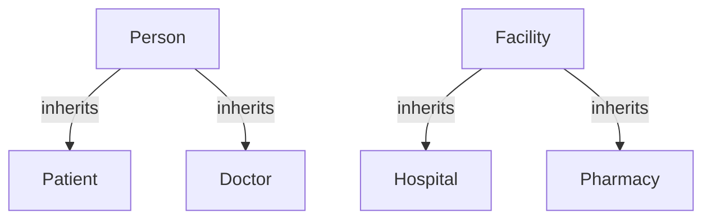
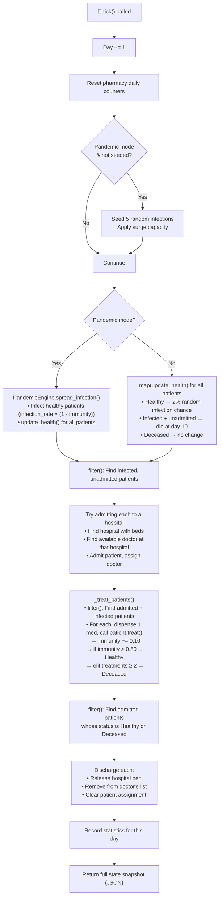
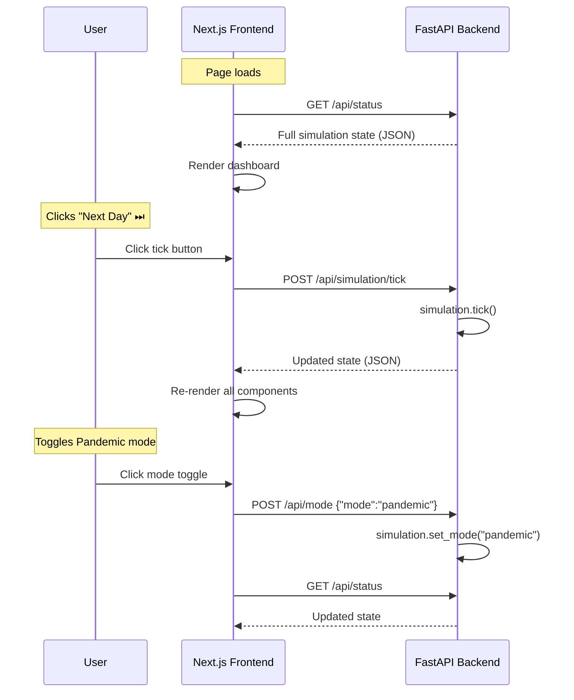
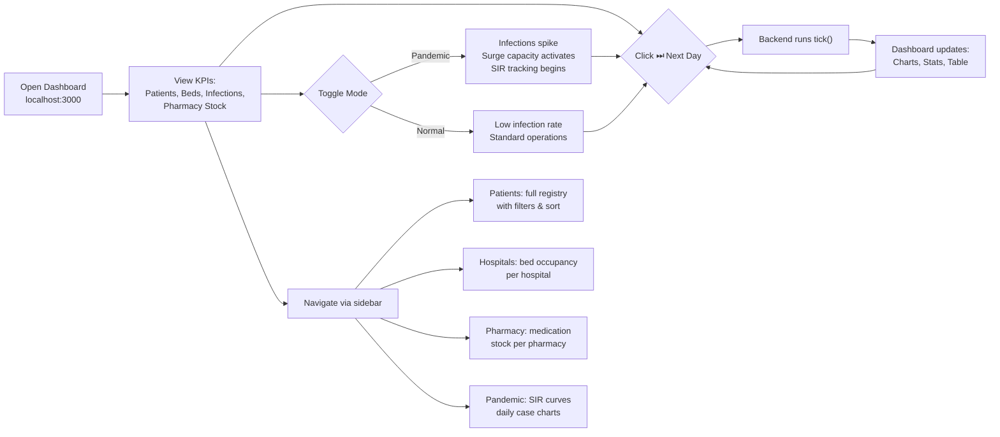

# MedSync — Healthcare Simulation System: Detailed Project Workflow

## 1. Project Overview

**MedSync** is a full-stack healthcare network simulator built as an academic project demonstrating core Object-Oriented Programming (OOP) principles — **inheritance**, **encapsulation**, **polymorphism**, and **multiple instantiation** — alongside functional programming constructs (`map()`, `filter()`, `reduce()`, list comprehensions).

The system simulates a healthcare network with **50 patients**, **12 doctors**, **3 hospitals**, and **2 pharmacies**, advancing day-by-day via a deterministic treatment model. It supports two operational modes: **Normal** and **Pandemic**.

| Layer | Technology | Purpose |
|-------|-----------|---------|
| Backend | Python 3.10+ / FastAPI | Simulation engine, REST API |
| Frontend | Next.js 16 / React | Dashboard UI, charts, tables |
| Communication | REST API (no WebSocket) | User-driven tick model |
| Charts | Recharts | Area/Bar/Line charts |

---

## 2. Project Structure

```
PythonHealthcareSystemSimulationProject/
├── Main.py                          # Launcher — starts both servers
├── requirements.txt                 # Python deps (fastapi, uvicorn)
├── UML_class.png                    # Class diagram
│
├── backend/
│   ├── __init__.py
│   ├── app.py                       # FastAPI application setup + CORS
│   ├── config.py                    # Global constants
│   │
│   ├── models/                      # OOP domain models
│   │   ├── person.py                # Person → Patient, Doctor
│   │   ├── facility.py              # Facility → Hospital, Pharmacy
│   │   └── simulation_mode.py       # Normal / Pandemic configuration
│   │
│   ├── engine/                      # Simulation logic
│   │   ├── simulation.py            # Core tick engine (HealthcareSimulation)
│   │   ├── pandemic.py              # Infection spread (PandemicEngine)
│   │   └── statistics.py            # Time-series data collector
│   │
│   └── api/
│       ├── __init__.py
│       └── routes.py                # REST endpoint definitions
│
└── frontend/                        # Next.js 16 application
    ├── package.json
    └── src/app/
        ├── layout.js                # Root layout + metadata
        ├── globals.css              # Design system
        ├── page.js                  # Dashboard (home)
        ├── patients/page.js         # Patient registry
        ├── hospitals/page.js        # Hospital capacity
        ├── pharmacy/page.js         # Medication inventory
        ├── pandemic/page.js         # Pandemic monitoring
        ├── hooks/useSimulation.js   # REST API hook
        └── components/
            ├── Sidebar.js           # Navigation + controls
            ├── StatCard.js          # KPI metric cards
            ├── PatientTable.js      # Sortable/filterable table
            ├── BedChart.js          # Bar chart (bed occupancy)
            └── InfectionChart.js    # Area chart (infection curves)
```

---

## 3. UML Class Diagram


> [!NOTE]
> The UML diagram above was created before the latest simplification. The actual code has been updated: `SimulationMode` no longer has `recovery_rate` / `mortality_rate`, and `PandemicEngine` no longer tracks recoveries. The `Patient` class now includes `treat()` and `treatments_received`.

---

## 4. OOP Concepts Demonstrated

### 4.1 Inheritance

Two parallel inheritance hierarchies:



- **Person → Patient**: Adds `health_status`, `immunity`, `days_infected`, `treatments_received`, `admitted`, `treat()`, `update_health()`, `infect()`, `admit()`, `discharge()`
- **Person → Doctor**: Adds `specialization`, `assigned_patients`, `max_patients`, `assign_patient()`, `remove_patient()`, `diagnose()`
- **Facility → Hospital**: Adds `total_beds`, `base_beds`, `patients`, `doctors`, `admit_patient()`, `discharge_patient()`, `apply_surge_capacity()`
- **Facility → Pharmacy**: Adds `inventory` (dict), `prescriptions_filled`, `fill_prescription()`, `reset_daily_count()`

### 4.2 Encapsulation

- **Patient.immunity** is a float managed internally — external code calls `treat()` which encapsulates the immunity-boost + threshold-check + status-transition logic
- **Hospital.available_beds** is a `@property` computed from `total_beds - occupied_beds` — callers don't access the patient list directly
- **Hospital.occupied_beds** is also a `@property` returning `len(self.patients)`

### 4.3 Multiple Instantiation

Created at simulation startup in [simulation.py](file:///Users/akshitbahl/Documents/Projects/HealthCareSimulator/PythonHealthcareSystemSimulationProject/backend/engine/simulation.py):
- **50 Patient** objects — random demographics (name, age, gender, contact)
- **12 Doctor** objects — rotating specializations
- **3 Hospital** objects — different bed capacities (120, 80, 100)
- **2 Pharmacy** objects — each with 8 medications in stock

### 4.4 Functional Programming Constructs

| Construct | Location | Usage |
|-----------|----------|-------|
| `map()` | [simulation.py:179](file:///Users/akshitbahl/Documents/Projects/HealthCareSimulator/PythonHealthcareSystemSimulationProject/backend/engine/simulation.py#L179) | Batch health updates for all patients |
| `map()` | [simulation.py:332-338](file:///Users/akshitbahl/Documents/Projects/HealthCareSimulator/PythonHealthcareSystemSimulationProject/backend/engine/simulation.py#L332-L338) | Serialize all patients/doctors/hospitals/pharmacies to dicts |
| `map()` | [statistics.py:67-84](file:///Users/akshitbahl/Documents/Projects/HealthCareSimulator/PythonHealthcareSystemSimulationProject/backend/engine/statistics.py#L67-L84) | Extract pharmacy stocks & prescription counts |
| `filter()` | [simulation.py:184-188](file:///Users/akshitbahl/Documents/Projects/HealthCareSimulator/PythonHealthcareSystemSimulationProject/backend/engine/simulation.py#L184-L188) | Find infected patients needing admission |
| `filter()` | [simulation.py:198-200](file:///Users/akshitbahl/Documents/Projects/HealthCareSimulator/PythonHealthcareSystemSimulationProject/backend/engine/simulation.py#L198-L200) | Find patients ready for discharge |
| `filter()` | [simulation.py:261-264](file:///Users/akshitbahl/Documents/Projects/HealthCareSimulator/PythonHealthcareSystemSimulationProject/backend/engine/simulation.py#L261-L264) | Find admitted infected patients for treatment |
| `filter()` | [pandemic.py:74-77](file:///Users/akshitbahl/Documents/Projects/HealthCareSimulator/PythonHealthcareSystemSimulationProject/backend/engine/pandemic.py#L74-L77) | Identify susceptible (healthy) patients for infection spread |
| `reduce()` | [simulation.py:341-353](file:///Users/akshitbahl/Documents/Projects/HealthCareSimulator/PythonHealthcareSystemSimulationProject/backend/engine/simulation.py#L341-L353) | Aggregate total occupied beds, total capacity, total medicines |
| `reduce()` | [statistics.py:53-85](file:///Users/akshitbahl/Documents/Projects/HealthCareSimulator/PythonHealthcareSystemSimulationProject/backend/engine/statistics.py#L53-L85) | Sum beds, occupied beds, pharmacy stock, prescriptions |
| List comp. | Throughout | Patient filtering, status counting, doctor lookup, inventory formatting |

---

## 5. Health System — 3-Status Deterministic Model

### 5.1 Health Statuses

The system uses exactly **3 health statuses**:

```
┌──────────┐     infection      ┌──────────┐    treatment     ┌──────────┐
│  HEALTHY │ ──────────────────→│ INFECTED │ ──────────────→  │  HEALTHY │
└──────────┘                    └──────────┘    (success)      └──────────┘
                                     │
                                     │ treatment fail
                                     │ OR 10 days unadmitted
                                     ▼
                                ┌──────────┐
                                │ DECEASED │
                                └──────────┘
```

### 5.2 Treatment Mechanics

Each patient starts with a random `immunity` between **0.10 and 0.50**. When infected and admitted to a hospital:

1. **Each tick (day)**, the assigned doctor gives 1 treatment
2. Each treatment: **+0.10 immunity** boost, 1 medication dispensed from pharmacy
3. If `immunity > 0.50` → patient becomes **Healthy** (immunity resets to a new random value)
4. If 2 treatments fail to cross the threshold → patient becomes **Deceased**
5. **Maximum 2 treatments** per infection

### 5.3 Treatment Outcome Distribution

| Starting Immunity | After Treatment 1 | After Treatment 2 | Outcome |
|---|---|---|---|
| **0.41 – 0.50** (≈24%) | > 0.50 ✓ | — | **Healthy** in 1 day |
| **0.31 – 0.40** (≈24%) | ≤ 0.50 | > 0.50 ✓ | **Healthy** in 2 days |
| **0.10 – 0.30** (≈52%) | ≤ 0.50 | ≤ 0.50 ✗ | **Deceased** in 2 days |

This produces an approximately **48% survival / 52% mortality** rate for treated patients.

### 5.4 Unadmitted Patient Rule

If an infected patient cannot be admitted (no available beds or no doctor capacity), they remain infected in the community. After **10 consecutive days** without admission, they automatically die — handled in [Patient.update_health()](file:///Users/akshitbahl/Documents/Projects/HealthCareSimulator/PythonHealthcareSystemSimulationProject/backend/models/person.py#L110-L136).

---

## 6. Simulation Tick — Step-by-Step Flow

Each time the user clicks **"Next Day"** (or the ⏭ button), the following happens in [HealthcareSimulation.tick()](file:///Users/akshitbahl/Documents/Projects/HealthCareSimulator/PythonHealthcareSystemSimulationProject/backend/engine/simulation.py#L143-L209):



---

## 7. Backend Architecture

### 7.1 Models Layer ([backend/models/](file:///Users/akshitbahl/Documents/Projects/HealthCareSimulator/PythonHealthcareSystemSimulationProject/backend/models/))

| Class | File | Key Attributes | Key Methods |
|-------|------|---------------|-------------|
| `Person` | [person.py](file:///Users/akshitbahl/Documents/Projects/HealthCareSimulator/PythonHealthcareSystemSimulationProject/backend/models/person.py#L25-L55) | `id`, `name`, `age`, `gender`, `contact` | `get_info()` |
| `Patient` | [person.py](file:///Users/akshitbahl/Documents/Projects/HealthCareSimulator/PythonHealthcareSystemSimulationProject/backend/models/person.py#L58-L179) | `health_status`, `immunity`, `treatments_received`, `days_infected`, `admitted` | `infect()`, `update_health()`, `treat()`, `admit()`, `discharge()` |
| `Doctor` | [person.py](file:///Users/akshitbahl/Documents/Projects/HealthCareSimulator/PythonHealthcareSystemSimulationProject/backend/models/person.py#L182-L255) | `specialization`, `assigned_patients`, `max_patients` | `assign_patient()`, `remove_patient()`, `diagnose()` |
| `Facility` | [facility.py](file:///Users/akshitbahl/Documents/Projects/HealthCareSimulator/PythonHealthcareSystemSimulationProject/backend/models/facility.py#L16-L46) | `id`, `name`, `location`, `facility_type`, `active` | `get_status()` |
| `Hospital` | [facility.py](file:///Users/akshitbahl/Documents/Projects/HealthCareSimulator/PythonHealthcareSystemSimulationProject/backend/models/facility.py#L49-L130) | `total_beds`, `base_beds`, `doctors[]`, `patients[]` | `admit_patient()`, `discharge_patient()`, `apply_surge_capacity()` |
| `Pharmacy` | [facility.py](file:///Users/akshitbahl/Documents/Projects/HealthCareSimulator/PythonHealthcareSystemSimulationProject/backend/models/facility.py#L133-L189) | `inventory{}`, `prescriptions_filled` | `fill_prescription()`, `reset_daily_count()` |
| `SimulationMode` | [simulation_mode.py](file:///Users/akshitbahl/Documents/Projects/HealthCareSimulator/PythonHealthcareSystemSimulationProject/backend/models/simulation_mode.py) | `mode`, `infection_rate`, `surge_capacity_multiplier` | `toggle()`, `set_mode()`, `is_pandemic` |

### 7.2 Engine Layer ([backend/engine/](file:///Users/akshitbahl/Documents/Projects/HealthCareSimulator/PythonHealthcareSystemSimulationProject/backend/engine/))

| Class | File | Responsibility |
|-------|------|---------------|
| `HealthcareSimulation` | [simulation.py](file:///Users/akshitbahl/Documents/Projects/HealthCareSimulator/PythonHealthcareSystemSimulationProject/backend/engine/simulation.py) | Core engine — population generation, tick loop, admissions, treatments, discharges |
| `PandemicEngine` | [pandemic.py](file:///Users/akshitbahl/Documents/Projects/HealthCareSimulator/PythonHealthcareSystemSimulationProject/backend/engine/pandemic.py) | Infection spread, SIR counting (Healthy/Infected/Deceased) |
| `StatisticsCollector` | [statistics.py](file:///Users/akshitbahl/Documents/Projects/HealthCareSimulator/PythonHealthcareSystemSimulationProject/backend/engine/statistics.py) | Records daily snapshots: patient counts, bed occupancy, pharmacy stock |

### 7.3 API Layer ([backend/api/routes.py](file:///Users/akshitbahl/Documents/Projects/HealthCareSimulator/PythonHealthcareSystemSimulationProject/backend/api/routes.py))

| Method | Endpoint | Description |
|--------|----------|-------------|
| `GET` | `/api/status` | Full simulation state snapshot |
| `GET` | `/api/hospitals` | All hospitals with occupancy data |
| `GET` | `/api/hospitals/{id}` | Single hospital with assigned patients & doctors |
| `GET` | `/api/patients` | All patients with status |
| `GET` | `/api/doctors` | All doctors with assignments |
| `GET` | `/api/pharmacy` | Pharmacy inventories |
| `GET` | `/api/statistics` | Time-series records for charts |
| `POST` | `/api/mode` | Switch Normal ↔ Pandemic (`{"mode": "pandemic"}`) |
| `POST` | `/api/simulation/tick` | Advance one day — returns updated state |
| `POST` | `/api/simulation/reset` | Reset to Day 0 with fresh population |

### 7.4 FastAPI App ([backend/app.py](file:///Users/akshitbahl/Documents/Projects/HealthCareSimulator/PythonHealthcareSystemSimulationProject/backend/app.py))

- Creates a single global `HealthcareSimulation` instance
- Configures CORS for `localhost:3000` (Next.js)
- Mounts the API router at `/api`
- Provides a root `/` health check endpoint

---

## 8. Frontend Architecture

### 8.1 Communication Pattern

The frontend uses a **user-driven REST model** (no WebSocket, no polling):



This is implemented in the [useSimulation](file:///Users/akshitbahl/Documents/Projects/HealthCareSimulator/PythonHealthcareSystemSimulationProject/frontend/src/app/hooks/useSimulation.js) custom hook.

### 8.2 Page Map

| Page | Route | Key Components | Data Used |
|------|-------|---------------|-----------|
| **Dashboard** | `/` | StatCard ×6, BedChart, InfectionChart, PatientTable | `overview`, `patients`, `hospitals`, `pharmacies`, `statistics`, `sir` |
| **Patients** | `/patients` | StatCard ×4, PatientTable | `patients`, `hospitals` |
| **Hospitals** | `/hospitals` | BedChart, Hospital cards with occupancy bars | `hospitals`, `doctors` |
| **Pharmacy** | `/pharmacy` | StatCard ×3 per pharmacy, medication grid | `pharmacies` |
| **Pandemic** | `/pandemic` | SIR cards ×3, StatCard ×4, InfectionChart, Daily cases chart, parameters | `sir`, `pandemic`, `statistics`, `mode` |

### 8.3 Component Hierarchy

```mermaid
graph TD
    Layout["RootLayout<br/>(layout.js)"]
    Layout --> Dashboard["Dashboard Page<br/>(page.js)"]
    Layout --> Patients["Patients Page<br/>(patients/page.js)"]
    Layout --> Hospitals["Hospitals Page<br/>(hospitals/page.js)"]
    Layout --> Pharmacy["Pharmacy Page<br/>(pharmacy/page.js)"]
    Layout --> Pandemic["Pandemic Page<br/>(pandemic/page.js)"]

    Dashboard --> Sidebar
    Dashboard --> SC1["StatCard ×6"]
    Dashboard --> BedChart
    Dashboard --> InfectionChart
    Dashboard --> PatientTable

    Patients --> Sidebar
    Patients --> SC2["StatCard ×4"]
    Patients --> PatientTable2["PatientTable"]

    Hospitals --> Sidebar
    Hospitals --> BedChart2["BedChart"]
    Hospitals --> HC["Hospital Cards"]

    Pharmacy --> Sidebar
    Pharmacy --> SC3["StatCard ×3 per pharmacy"]
    Pharmacy --> MedGrid["Medication Grid"]

    Pandemic --> Sidebar
    Pandemic --> SIR["SIR Cards ×3"]
    Pandemic --> SC4["StatCard ×4"]
    Pandemic --> InfectionChart2["InfectionChart"]
    Pandemic --> DailyChart["Daily Cases LineChart"]
```



---

## 9. Simulation Modes

### 9.1 Normal Mode

| Parameter | Value |
|-----------|-------|
| Infection Rate | 2% per tick per healthy patient |
| Surge Capacity Multiplier | 1.0× (no change) |
| Infection Source | Random chance each tick |

### 9.2 Pandemic Mode

| Parameter | Value |
|-----------|-------|
| Infection Rate | 12% base × `(1 - patient.immunity)` |
| Surge Capacity Multiplier | 1.5× (hospitals get 50% more beds) |
| Initial Seeding | 5 random healthy patients infected on activation |
| Infection Source | PandemicEngine spreads from existing infected |

When toggling from **Pandemic → Normal**:
- Pandemic seeding flag resets
- PandemicEngine counters reset
- Hospital beds return to base capacity

---

## 10. Data Flow — Complete JSON Snapshot

When `GET /api/status` is called, the response has this structure:

```json
{
  "day": 10,
  "mode": {
    "mode": "normal",
    "is_pandemic": false,
    "infection_rate": 0.02,
    "surge_capacity_multiplier": 1.0
  },
  "overview": {
    "total_patients": 50,
    "total_doctors": 12,
    "total_hospitals": 3,
    "total_pharmacies": 2,
    "total_beds": 300,
    "total_occupied_beds": 5,
    "total_available_beds": 295,
    "overall_occupancy": 1.7,
    "total_medicines_left": 3940
  },
  "patients": [
    {
      "id": "a1b2c3d4",
      "name": "James Smith",
      "age": 42,
      "gender": "Male",
      "contact": "+1-555-123-4567",
      "health_status": "Infected",
      "days_infected": 2,
      "admitted": true,
      "assigned_facility": "f1e2d3c4",
      "assigned_doctor": "d5e6f7a8",
      "immunity": 0.35,
      "treatments_received": 1
    }
  ],
  "doctors": [ ... ],
  "hospitals": [ ... ],
  "pharmacies": [ ... ],
  "pandemic": null,
  "sir": null,
  "statistics": [ ... ]
}
```

---

## 11. How to Run the Project

### Prerequisites
- Python 3.10+
- Node.js 18+ and npm

### Quick Start (Single Command)

```bash
cd PythonHealthcareSystemSimulationProject
python3 Main.py
```

This runs [Main.py](file:///Users/akshitbahl/Documents/Projects/HealthCareSimulator/PythonHealthcareSystemSimulationProject/Main.py) which:
1. Installs Python dependencies (`fastapi`, `uvicorn`) if missing
2. Runs `npm install` in `/frontend` if `node_modules` is missing
3. Starts the **FastAPI backend** on port 8000
4. Starts the **Next.js frontend** on port 3000
5. Opens `http://localhost:3000` in the browser after 5 seconds

### Manual Start (Two Terminals)

**Terminal 1 — Backend:**
```bash
cd PythonHealthcareSystemSimulationProject
pip install -r requirements.txt
python3 -m uvicorn backend.app:app --reload --port 8000
```

**Terminal 2 — Frontend:**
```bash
cd PythonHealthcareSystemSimulationProject/frontend
npm install
npm run dev
```

Then open `http://localhost:3000`.

---

## 12. User Interaction Workflow



---

## 13. Key Design Decisions

| Decision | Rationale |
|----------|-----------|
| **User-driven ticks** (no auto-tick) | Predictable, reproducible, no race conditions — ideal for academic demos |
| **3 health statuses** (no Mild/Severe/Critical/Recovered) | Simplifies state machine, makes treatment outcomes clear and deterministic |
| **Deterministic treatment** (immunity threshold) | Outcome depends on starting immunity — no random dice rolls during treatment |
| **10-day unadmitted death** | Creates capacity pressure — if hospitals are full, patients die, motivating pandemic mode surge capacity |
| **REST-only** (no WebSocket) | Simpler architecture; state only changes when user acts, so polling/push is unnecessary |
| **Global simulation singleton** | Single source of truth; `app.py` creates one `HealthcareSimulation` shared across all routes |
| **Pharmacy stock decrements per treatment** | Links treatment events to resource consumption — visible in pharmacy page |
